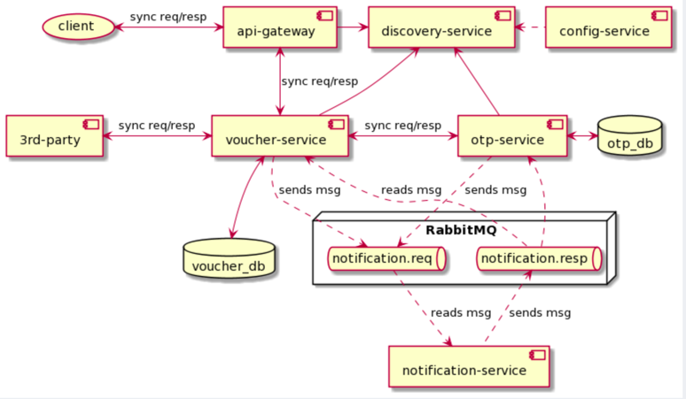

# voucher-data
A demo system for purchasing voucher data via sms. microservices patterns applied. 

## Component diagram

## Entity diagram

## Some explanation for the project
Applying microservices patterns, using Spring Cloud stack
### Interprocess communication

#### Remote procedure invocation
A client invokes a service using a synchronous, remote procedure invocation-based protocol, such as REST (http://microservices.io/patterns/communication-style/messaging.html).

#### Messaging 
A client invokes a service using asynchronous messaging. See http://microservices.io/patterns/communication-style/messaging.html.

#### Self registration pattern
A service instance registers itself with the service registry. See http://microservices.io/patterns/self-registration.html.

#### Client-side discovery
A service client retrieves the list of available service instances from the service reg- istry and load balances across them. See http://microservices.io/patterns/client-side-discovery.html.

### Timeout pattern
Never block indefinitely and always use timeouts when waiting for a response. Using timeouts ensures that resources are never tied up indefinitely.

This is used in voucher-service, when it makes sync call to the third party for voucher code. After timeout reaches, voucher-service returns to client a message: "the request is being processed within 30 seconds".
### OOP design pattern
Method factory

## Libraries and Frameworks

* Spring boot 2.3.9.RELEASE:
  * Spring-boot-starter-web
  * Spring-boot-starter-data-jpa
  * Spring-boot-starter-security
  * Spring-boot-starter-actuator

* Spring cloud Hoxton.SR10
  * Spring Cloud Gateway
  * Spring Cloud Openfeign
  * Spring Cloud Config
  * Spring Cloud Netflix
    * spring-cloud-starter-netflix-ribbon
    * spring-cloud-starter-netflix-eureka-client
    * spring-cloud-starter-netflix-ribbon
  * resilience4j-spring-boot2
  * spring-cloud-starter-stream-rabbit
  * spring-cloud-stream-binder-rabbit
    
## Project structure

## How to run in local

-	Install docker engine in local, to ease to install RabbitMQ, MySQL server.
-	Install MySQL: Please refer: https://dev.mysql.com/doc/mysql-installation-excerpt/8.0/en/docker-mysql-getting-started.html
-	Install RabbitMQ:
> docker run -d --hostname my-rabbit --name rabbit-local -p 5671-5672:5671-5672 -p 15671-15672:15671-15672 -p 25672:25672 -p 4369:4369 rabbitmq:3-management
-	Build all projects in voucher-data folder: mvn clean install
-	For each jar file built inside target, run below command to start service, example:

> nohup java -jar discovery-service.jar &
-	Note: These properties are required to start services:

For voucher-services, otp-services:
spring.datasource.url= jdbc url pointing to mysql database
spring.datasource.username= database credential username
spring.datasource.password= database credential password

## CURL commands
* Get voucher, assume orderId was issued after payment has been done.
> curl --header "Content-Type: application/json" \
--request POST \
--data '{"orderId":"xyz","phoneNo":"012345689"}' \
http://localhost:7777/voucher-service/get-voucher

* List purchased voucher by phone number. Initial API, server will send OTP to the phone.
> curl --header "Content-Type: application/json" \
--request POST \
--data '{"phoneNo":"012345689"}' \
http://localhost:7777/voucher-service/list-voucher

* After user receives OTP, client uses this API to request list of purchased vouchers
> curl --header "Content-Type: application/json" \
--request POST \
--data '{"phoneNo":"012345689", "otp": {"code":"otp_received", "refNo": "ref_no_returned_by_initial_api"}}' \
http://localhost:7777/voucher-service/list-voucher

## Remaining Task Lists
- [ ] API gateway
- [ ] Config service
- [ ] Unit test coverage